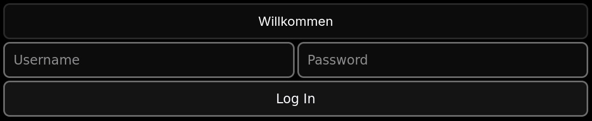
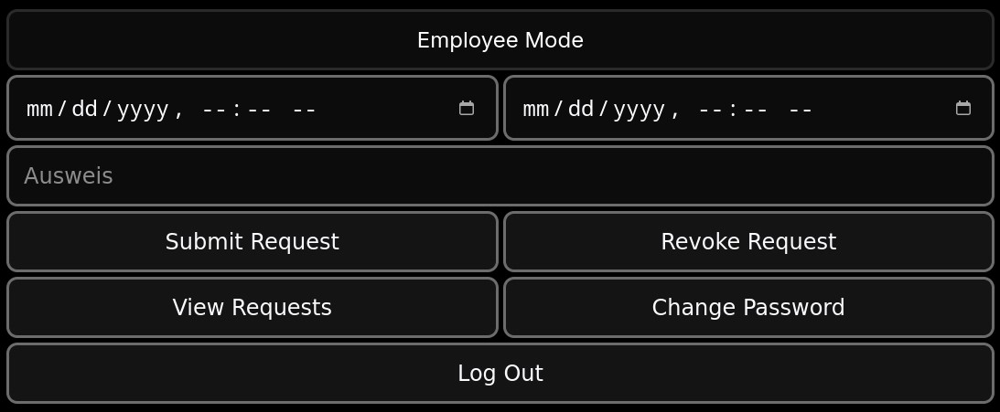
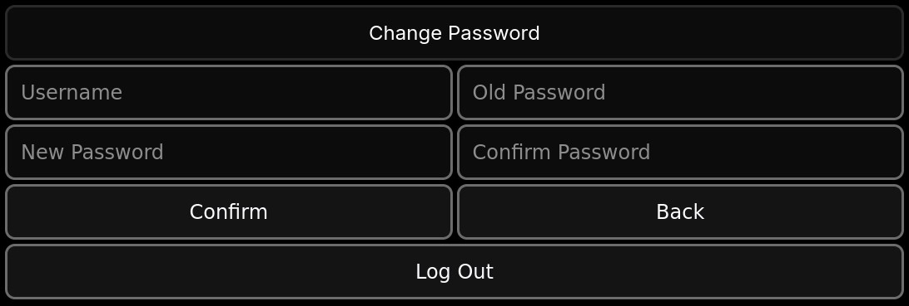
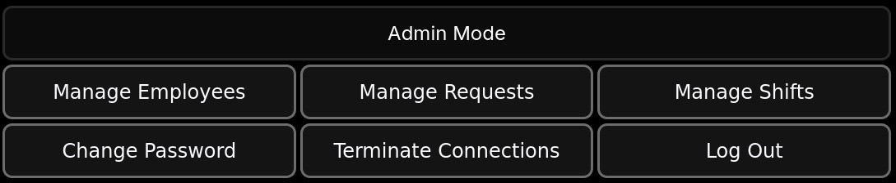
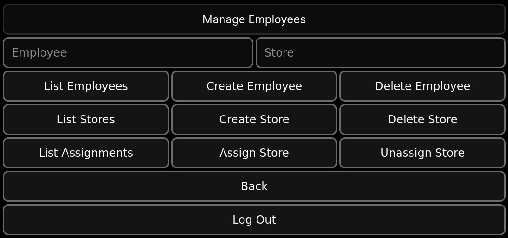
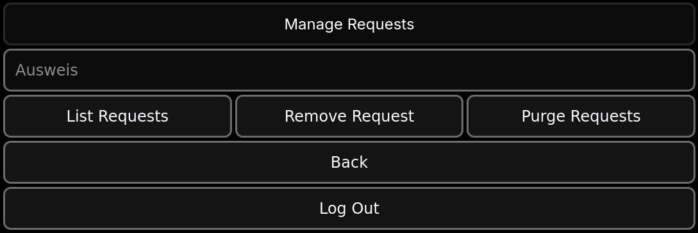
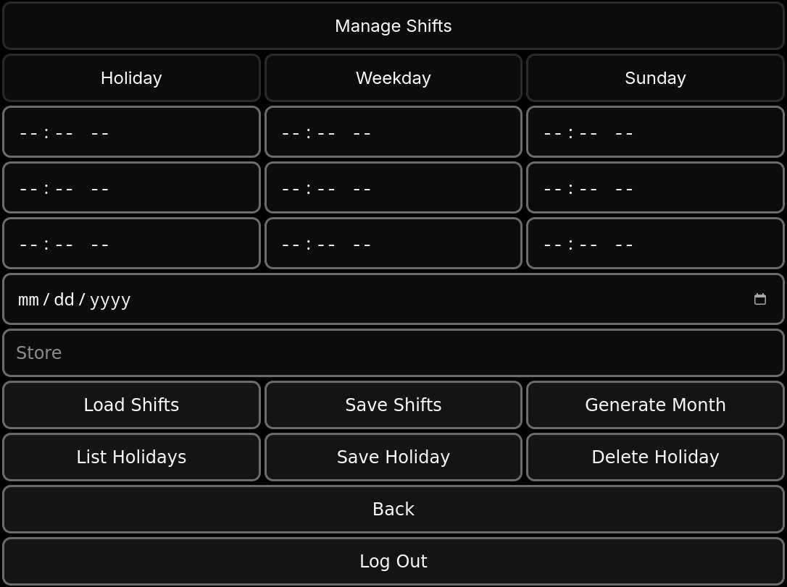

<a name="top"/>

# PCR Players' Club PTO request
- [Table of Contents](#top)
  - [Quick Start](#quick-start)
  - [Set Up](#set-up)
    - [Environmental Variables](#environmental-variables)
    - [Docker Network](#docker-network)
    - [Running Containers](#running-containers)
  - [Operation](#operation)
    - [Login Page](#login-page)
    - [Employee Mode](#employee-mode)
    - [Change Password](#change-password)
    - [Admin Mode](#admin-mode)
    - [Manage Employees](#manage-employees)
    - [Manage Requests](#manage-requests)
    - [Manage Shifts](#manage-shifts)
- [Deutsch](#deutsch)

[top](#top)
## Set up
- Designed to run on [these containers](https://hub.docker.com/r/maxhougas/pcrpto)

[top](#top)
## Quick Start
- Get docker
  - Alpine: `apk update && apk add docker`
  - Arch: `pacman -Syy && pacman -S docker`
  - Debian: `apt update && apt install docker.io`
  - Windows:
```
powershell "$ProgressPreference = 'SilentlyContinue'; wget 'https://desktop.docker.com/win/main/amd64/Docker%20Desktop%20Installer.exe?utm_source=docker&utm_medium=webreferral&utm_campaign=docs-driven-download-win-amd64&_gl=1*qd0t7e*_ga*MzI3MDkyMTY0LjE2OTgwODEzMTI.*_ga_XJWPQMJYHQ*MTc0MDc3MTQ0Ny4yMjQuMC4xNzQwNzcxNDUxLjU2LjAuMA..' -outfile dockerinstall.exe; ./dockerinstall.exe"
```

    - Human readable: [docs.docker.com](https://docs.docker.com/desktop/setup/install/windows-install/)
- Ensure virtualization is enabled in your BIOS (See documentation from your motherboard manufacturer)
- Run the following commands from the relevant shell (on windows this will be the terminal emulator inside Docker desktop)
```
docker network create -d bridge --subnet=172.31.0.0/29 pcrpto
docker run -de BOSPAS=pass1 -e DEFPAS=pass2 -e EMPPAS=pass3 -e NIP=172.31.0.3 --network=pcrpto --ip=172.31.0.2 --name pcrmar maxhougas/pcrpto:mar
docker run -de BOSPAS=pass1 -e CRTPAS=pass4 -e DEFPAS=pass2 -e EMPPAS=pass3 -e MIP=172.31.0.2 -e MPORT=3306 -e NIP=172.31.0.3 -e NPORT=5000 --network=pcrpto --ip=172.31.0.3 -p 0.0.0.0:5000:5000/tcp --name pcrpro maxhougas/pcrpto:pro
```

[top](#top)
### Environmental Variables
- BOSPAS(bospas): PTO admin DB password
- CLIPATH(/home/user/pcrpto/client/out): Path to the folder containing static resources (index.html); this may be omitted in usual cases.
- CRTPAS(crtpas): SSL certificate password
- DEFPAS(defpas): Default password for frontend users
- EMPPAS(emppas): DB password for regular users
- MIP(172.17.0.1): IP address of the DB
- MPORT(3306): Port the DB listens on
- NIP(%): IP address of the node back end
- NPORT(5000): Port the node back end listens on

It is recommended to create a environment variables file and pass it to the containers at run time

The following is an example file with the default values:
```
BOSPAS=bospas
CLIPATH=/home/user/pcrpto/client/out
CRTPAS=crtpas
DEFPAS=defpas
EMPPAS=emppas
MIP=172.17.0.1
MPORT=3306
NIP=172.17.0.1
NPORT=5000
```
NOTA BENE: These default values *SHOULD NOT* be used for long term operations.

[top](#top)
### Docker Network
- The default (bridge) network will not allow user specified IP addresses for containers.
- Create a custom network with the following

`docker network create -d bridge --subnet=172.31.0.0/29 pcrpto`

- The subnet may be altered as necessary; 172.31.0.0/29 is an example that is likely to work.
- Check your local network configuration to determine which subnets are already in use
  - Most common networks already in use are 10.0.0.0/8 and 192.168.0.0/16
- It is *highly* recommended that you use IPv4 ranges IANA has reserved for private use
  - These are 10.0.0.0 - 10.255.255.255, 172.16.0.0 - 172.31.255.255, and 192.168.0.0 - 192.168.255.255
  - [Wikipedia](https://en.wikipedia.org/wiki/Reserved_IP_addresses#IPv4)
  - [RFC6890](https://www.rfc-editor.org/rfc/rfc6890#section-2.2.2) See tables 2, 6, and, 11
  - [RFC1918](https://www.rfc-editor.org/rfc/rfc1918#section-3)

[top](#top)
### Running Containers
- Containers can be run with the following

```
docker run -d --network=pcrpto --ip=IPV4ADDR -p 0.0.0.0:EXPORT:INPORT/tcp --env-file ENVFILE --name CONTAINERNAME maxhougas/pcrpto:TAG
```

  - IPV4ADDR(172.31.0.2 OR 172.31.0.3): Some ipv4 address within the range.
    - The first address (.0) refers to the network itself
    - The second address (.1) is usually the default gateway
    - The last address (Usually .255, but .7 in our example) is the broadcast address for the network
    - Any other address should be available for specific hosts. We will use .2 for the database and .3 for the back end.
  - EXPORT(3306 OR 5000)
    - The external port the container will listen on
    - Ensure that it does not conflict with anything else listening on the host system
    - We will use 3306 for the database and 5000 for the back end
    - Verify current listeing ports with `lsof -nP -iTCP:3306 -sTCP:LISTEN` and `lsof nP -iTCP:5000 -sTCP:LISTEN`
    - These may be adjusted based on need provided that the relvante changes are made in the evironment variables file
  - INPORT(3306 OR 5000)
    - The internal port the containerized program is listening on
    - The database internal port cannot be changed at this time; it must remain 3306

NOTA BENE: If the database container is running on the same docker network as the back end container (which it is in this example) then the -p switch can *AND SHOULD* be skipped entirely for it e.g.

`docker run -d --network=pcrpto --ip=172.31.0.2 --env-file envfile --name pcrmar maxhougas/pcrpto:mar`

This will prevent PAT from external networks to the database container granting confidence that the only host able to access the database is the back end container; moreover, in this case the database eo ipso can be configured to only accept logins from the IPv4 address of the back end container (i.e. setting [environmental variable](#environmental-variables) NIP to the IPv4 address assigned to the back end container, which in this example is 172.31.0.3) granting additional confidence. In the case that the database and back end containers are running on separate docker networks, the database container will view all incoming packets as originating from its network's default gateway, and thus access must be controlled via other means (e.g. firewall rules); moreover, the database must then be configured to accept logins from the default gateway.

  - ENVFILE
    - Path/name of the environment variable file you made [here](#environmental-varaibles)
  - CONTAINERNAME(pcrmar OR pcrpro)
    - Abitrary name for the container; we will be using pcrmar for the database, and pcrpro for the back end
  - TAG(mar OR pro)
    - Tag for the image the container is being built from; mar is the database image, and pro is the back end image

[top](#top)
## Operation

### Login Page

- Type random things into both boxes until it works

[top](#top)
### Employee Mode

- Submit Request
  - Put the start time in the left datetime box
  - Put the end time in the right datetime box
  - Press `Submit Request`
- Revoke Request
  - Press View Requests
  - Copy the ID number into the Ausweis box
  - Press `Revoke Request`

[top](#top)
### Change Password

- Enter user name into the top left box
- Enter current password into the top right box
- Enter the new password into both bottom boxes
- Press `Confirm`

[top](#top)
### Admin Mode

- [Manage Employees](#manage-employees), [Manage Requests](#manage-requests), and [Manage Shifts](#manage-shifts) are submenus.
- [Change Password](#change-password) is identical to the employee version.
- `Terminate Connections` will instruct the back end to purge all session tokens effectively logging everyone out.
  - This will confuse and enrage anyone who is still logged in; use with care.

[top](#top)
### Manage Employees

- `List Employees` will display all registered employees.
- `Create Employee` will create an employee with the employee id currently in the left box.
- `Delete Employee` will remove an employee record from the database.
- `List Stores` will display all registered stores.
- `Create Store` will create a store with the store id currently in the right box.
- `Delete Store` will remove a store record from the database.
- `List Assignments` will show which employees are assigned to which stores.
  - If the left and right box are both empty, all assignments are displayed.
  - If the left box contains an employee id, assignments matching that employee id are displayed
  - If the left box is empty and the right box contains a store id, assigments matching that store id are displayed.
- `Assign Store` will assign the employee id in the left box to the store id in the right box.
- `Unassign Store` will remove the assignment record of the employee id in the left box to the store id in the right box.

[top](#top)
### Manage Requests

- `List Requests` will display all requests by all registered employees in order of request time.
- `Remove Request` will delete the record of the request for which the request ID matches the value of the Ausweis box.
- `Purge Reuqests` will delete all request records and reset the auto incrementing ID field.

[top](#top)
### Manage Shifts

- `Load Shifts` will display the default shift times for the store in the Store box in the six top-right boxes.
  - From top to bottom the times are Start of Day, Shift Change, and End of Day for weekdays and Sunday as labelled.
- `Save Shifts` will save any alterations made to default shift times for the store in the Store box to the database.
- `Generate Month` will generate a list of employees whose PTO requests conflict with default shifts or holiday shifts from the date specified to five weeks thereafter.
- `List Holidays` will show all holiday shift times for the store specified in the Store box.
- `Save Holiday` will create a holiday record for the specified date and store with the shift times specified in the three top left boxes.
  - These boxes represent Start of Day, Shift Change, and End of Day similarly to the default shift times.
  - To specify that there is no shift for a certain day simply declare the start and end times to be the same. For example if there is to be no first shift on New Year's Day 1990 the the top-left box and the middle-left box could both be set to 12:00 PM, and the left-third box should be set to whenever the second shift ends.
 
[top](#top)
# Deutsch
- Ich spreche kein Deutsch :(

[top](#top)
